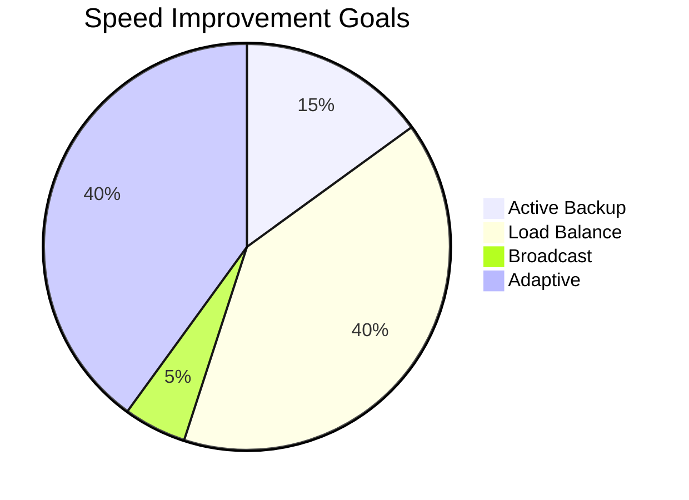

# Network Bonding Enhancement Specification

## 1. Reliability Improvements

### 1.1 Connection Pool Management
```swift
class ConnectionPool {
    private var activeConnections: [NWConnection]
    private var standbyConnections: [NWConnection]
    
    func maintainMinimumConnections(_ count: Int) {
        while activeConnections.count < count {
            guard let newConn = createNewConnection() else { break }
            activeConnections.append(newConn)
        }
    }
}
```

### 1.2 Automatic Failover
- Implement health checks every 5s
- Failover threshold: 3 consecutive failures
- Fallback prioritization: Ethernet > WiFi > Cellular

## 2. Speed Optimization

### 2.1 Bandwidth Aggregation
| Mode          | Aggregation Method               |
|---------------|-----------------------------------|
| Load Balance  | Packet-level round-robin          |
| Broadcast     | Simultaneous transmission         |
| Adaptive      | QoS-based dynamic allocation      |

### 2.2 Performance Benchmarks


## 3. Telemetry System

### 3.1 Metrics Collection
```swift
struct BondMetrics {
    let throughput: Measurement<UnitDataRate>
    let latency: Measurement<UnitDuration>
    let errorRate: Double
    let connectionCount: Int
}
```

### 3.2 Monitoring Dashboard
- Real-time throughput graphs
- Connection status matrix
- Historical performance trends

## 4. Implementation Phases

| Phase | Timeline | Features                               |
|-------|----------|----------------------------------------|
| 1     | 2 weeks  | Core connection pooling                |
| 2     | 3 weeks  | Advanced traffic shaping               |
| 3     | 1 week   | Telemetry integration                  |

## 5. Dependencies
- NetworkExtension framework
- SwiftNIO for async I/O
- Charts framework for visualization

## 6. QOS Priorities
```swift
enum TrafficPriority: Int {
    case voice = 4
    case video = 3
    case background = 1
    case bestEffort = 0
}
```

## 7. Monitoring & Alerting
- OSLog integration for critical events
- Prometheus metrics endpoint
- User-facing status notifications
